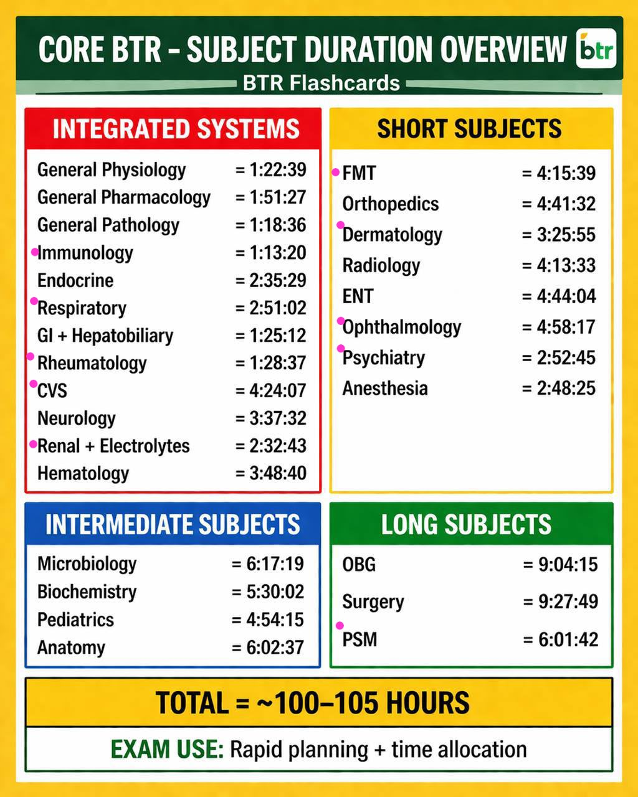

# NEET PG Final Sprint — Hour-by-Hour Schedule

**Window:** Thu 6 Aug – Mon 17 Aug 2026 (12 days). Exam: Sun 30 Aug 2026.
**Daily commitment:** 11h planned study + 1h unplanned reserve (backlog only).

---

## Syllabus 

## Scope

Subjects done **sequentially** (finish one, start the next), in **momentum order** — quick wins first, heaviest subject last:

1. **Immunology** (IS-04)
2. **Rheumatology** (IS-08)
3. **Respiratory** (IS-06)
4. **Renal + Electrolytes** (IS-11)
5. **CVS** (IS-09)
6. **PSM** (LS-03)
7. **FMT** (SS-01)
8. **Dermatology** (SS-03)

**Dropped (lowest priority, no new content after 17 Aug):** Ophthalmology, Psychiatry.

**Definition of done (per subject):** every video fully understood at 4× pace **+** that video's MCQs attempted (≤ 45 min per video, hard cap).

---

## Key Numbers (at your pace: 4× video understanding, ~50-min videos, 45-min MCQ cap/video)

| Subject | Videos | Video study (4×) | MCQs (45 min × videos) | Total |
|--------:|-------:|------------------:|------------------------:|------:|
| Immunology | 1 | 4h 53m | 45m | 5h 38m |
| Rheumatology | 2 | 5h 55m | 1h 30m | 7h 25m |
| Respiratory | 3 | 11h 24m | 2h 15m | 13h 39m |
| Renal + Electrolytes | 3 | 10h 11m | 2h 15m | 12h 26m |
| CVS | 5 | 17h 37m | 3h 45m | 21h 22m |
| PSM | 7 | 24h 07m | 5h 15m | 29h 22m |
| FMT | 5 | 17h 02m | 3h 45m | 20h 47m |
| Dermatology | 4 | 13h 44m | 3h 00m | 16h 44m |
| **Total** | **30** | **~104h 53m** | **~22h 30m** | **~127h 23m** |

> Video counts estimated at ~50 min avg (rounded to nearest); adapt the `Video x/y` labels to the real counts in the app. The 45-min MCQ cap is the controlling limit — if a video's MCQs finish early, that time is **your slack**.

---

## Daily Template (every day)

| Time | Block |
|------|-------|
| 08:00–10:00 | Video study — current subject |
| 10:00–10:30 | Break |
| 10:30–12:30 | Video study — current subject |
| 12:30–13:30 | Lunch + rest |
| 13:30–15:00 | **MCQ block** — MCQs for videos completed this morning (45 min/video) |
| 15:00–15:30 | Break |
| 15:30–17:30 | Video study — current subject |
| 17:30–18:30 | Break + snacks |
| 18:30–20:00 | Video study — current subject |
| 20:00–21:00 | Dinner + rest |
| 21:00–22:30 | Video study — current subject |
| 22:30–23:00 | **Quick MCQ** — MCQs for evening videos (flex to 45 min) |
| 23:00–24:00 | Reserve — **never planned**, backlog only |

- **2-video days (~8.5h):** finish by ~22:30, keep the reserve untouched, sleep by 23:30.
- **3-video days (~12.5h):** MCQs run into the reserve slot; sleep ~24:00–01:00.

---

## Backlog & Drop Rules

1. Slippage first eats the **same-day reserve** (23:00–24:00).
2. If you still fall behind, the next day's morning starts **10 min early** and cuts the lunch break by 15 min until caught up.
3. **Drop chain (already active):** Ophthalmology and Psychiatry are **already dropped** — do not start them before 17 Aug.
4. If cumulative slippage exceeds **8h** even after using reserves, sacrifice in this order: **Dermatology → FMT**. Never touch a higher-priority subject to feed a lower one.
5. After **17 Aug 23:59**, no new content. Remaining pending subjects are abandoned, not deferred.

---

## Day 1 — Thu 6 Aug · Immunology + Rheumatology (2 videos)

| Time | Block |
|------|-------|
| 08:00–10:00 | Immunology — Video 1/1 |
| 10:00–10:30 | Break |
| 10:30–12:30 | Immunology — Video 1/1 |
| 12:30–13:30 | Lunch + rest |
| 13:30–15:00 | MCQ — Immunology MCQs (≤45 min) + start Rheumatology |
| 15:00–15:30 | Break |
| 15:30–17:30 | Rheumatology — Video 1/2 |
| 17:30–18:30 | Break + snacks |
| 18:30–20:00 | Rheumatology — Video 1/2 |
| 20:00–21:00 | Dinner + rest |
| 21:00–22:30 | Rheumatology — Video 1/2 |
| 22:30–23:00 | MCQ — Rheumatology Video 1 MCQs (≤45 min) |
| 23:00–24:00 | Reserve — unplanned |

**Achieved if followed:** ✅ **Immunology complete** (videos + MCQs). ✅ Rheumatology Video 1/2 understood + MCQs done. ~9h studied, reserve intact.

---

## Day 2 — Fri 7 Aug · Rheumatology finish + Respiratory start (3 videos)

| Time | Block |
|------|-------|
| 08:00–10:00 | Rheumatology — Video 2/2 |
| 10:00–10:30 | Break |
| 10:30–12:30 | Rheumatology — Video 2/2 |
| 12:30–13:30 | Lunch + rest |
| 13:30–15:00 | MCQ — Rheumatology Video 2 MCQs (≤45 min) |
| 15:00–15:30 | Break |
| 15:30–17:30 | Respiratory — Video 1/3 |
| 17:30–18:30 | Break + snacks |
| 18:30–20:00 | Respiratory — Video 1/3 |
| 20:00–21:00 | Dinner + rest |
| 21:00–22:30 | Respiratory — Video 2/3 |
| 22:30–23:00 | MCQ — Respiratory Video 1 MCQs (≤45 min) |
| 23:00–24:00 | MCQ — Respiratory Video 2 MCQs (≤45 min, uses reserve) |

**Achieved if followed:** ✅ **Rheumatology complete.** ✅ Respiratory Videos 1–2 understood + MCQs done. ~12.5h studied.

---

## Day 3 — Sat 8 Aug · Respiratory finish + Renal start (3 videos)

| Time | Block |
|------|-------|
| 08:00–10:00 | Respiratory — Video 3/3 |
| 10:00–10:30 | Break |
| 10:30–12:30 | Respiratory — Video 3/3 |
| 12:30–13:30 | Lunch + rest |
| 13:30–15:00 | MCQ — Respiratory Video 3 MCQs (≤45 min) |
| 15:00–15:30 | Break |
| 15:30–17:30 | Renal — Video 1/3 |
| 17:30–18:30 | Break + snacks |
| 18:30–20:00 | Renal — Video 1/3 |
| 20:00–21:00 | Dinner + rest |
| 21:00–22:30 | Renal — Video 2/3 |
| 22:30–23:00 | MCQ — Renal Video 1 MCQs (≤45 min) |
| 23:00–24:00 | MCQ — Renal Video 2 MCQs (≤45 min, uses reserve) |

**Achieved if followed:** ✅ **Respiratory complete.** ✅ Renal Videos 1–2 understood + MCQs done. ~12.5h studied.

---

## Day 4 — Sun 9 Aug · Renal finish + CVS start (3 videos)

| Time | Block |
|------|-------|
| 08:00–10:00 | Renal — Video 3/3 |
| 10:00–10:30 | Break |
| 10:30–12:30 | Renal — Video 3/3 |
| 12:30–13:30 | Lunch + rest |
| 13:30–15:00 | MCQ — Renal Video 3 MCQs (≤45 min) |
| 15:00–15:30 | Break |
| 15:30–17:30 | CVS — Video 1/5 |
| 17:30–18:30 | Break + snacks |
| 18:30–20:00 | CVS — Video 1/5 |
| 20:00–21:00 | Dinner + rest |
| 21:00–22:30 | CVS — Video 2/5 |
| 22:30–23:00 | MCQ — CVS Video 1 MCQs (≤45 min) |
| 23:00–24:00 | MCQ — CVS Video 2 MCQs (≤45 min, uses reserve) |

**Achieved if followed:** ✅ **Renal + Electrolytes complete.** ✅ CVS Videos 1–2 understood + MCQs done. ~12.5h studied.

---

## Day 5 — Mon 10 Aug · CVS mid (2 videos)

| Time | Block |
|------|-------|
| 08:00–10:00 | CVS — Video 3/5 |
| 10:00–10:30 | Break |
| 10:30–12:30 | CVS — Video 3/5 |
| 12:30–13:30 | Lunch + rest |
| 13:30–15:00 | MCQ — CVS Video 3 MCQs (≤45 min) |
| 15:00–15:30 | Break |
| 15:30–17:30 | CVS — Video 4/5 |
| 17:30–18:30 | Break + snacks |
| 18:30–20:00 | CVS — Video 4/5 |
| 20:00–21:00 | Dinner + rest |
| 21:00–22:30 | CVS — Video 4/5 |
| 22:30–23:00 | MCQ — CVS Video 4 MCQs (≤45 min) |
| 23:00–24:00 | Reserve — unplanned |

**Achieved if followed:** ✅ CVS Videos 3–4 understood + MCQs done. ~8.5h studied, reserve intact — sleep early.

---

## Day 6 — Tue 11 Aug · CVS finish + PSM start (3 videos)

| Time | Block |
|------|-------|
| 08:00–10:00 | CVS — Video 5/5 |
| 10:00–10:30 | Break |
| 10:30–12:30 | CVS — Video 5/5 |
| 12:30–13:30 | Lunch + rest |
| 13:30–15:00 | MCQ — CVS Video 5 MCQs (≤45 min) |
| 15:00–15:30 | Break |
| 15:30–17:30 | PSM — Video 1/7 |
| 17:30–18:30 | Break + snacks |
| 18:30–20:00 | PSM — Video 1/7 |
| 20:00–21:00 | Dinner + rest |
| 21:00–22:30 | PSM — Video 2/7 |
| 22:30–23:00 | MCQ — PSM Video 1 MCQs (≤45 min) |
| 23:00–24:00 | MCQ — PSM Video 2 MCQs (≤45 min, uses reserve) |

**Achieved if followed:** ✅ **CVS complete.** ✅ PSM Videos 1–2 understood + MCQs done. ~12.5h studied.

---

## Day 7 — Wed 12 Aug · PSM mid (2 videos)

| Time | Block |
|------|-------|
| 08:00–10:00 | PSM — Video 3/7 |
| 10:00–10:30 | Break |
| 10:30–12:30 | PSM — Video 3/7 |
| 12:30–13:30 | Lunch + rest |
| 13:30–15:00 | MCQ — PSM Video 3 MCQs (≤45 min) |
| 15:00–15:30 | Break |
| 15:30–17:30 | PSM — Video 4/7 |
| 17:30–18:30 | Break + snacks |
| 18:30–20:00 | PSM — Video 4/7 |
| 20:00–21:00 | Dinner + rest |
| 21:00–22:30 | PSM — Video 4/7 |
| 22:30–23:00 | MCQ — PSM Video 4 MCQs (≤45 min) |
| 23:00–24:00 | Reserve — unplanned |

**Achieved if followed:** ✅ PSM Videos 3–4 understood + MCQs done. ~8.5h studied, reserve intact.

---

## Day 8 — Thu 13 Aug · PSM finish (3 videos)

| Time | Block |
|------|-------|
| 08:00–10:00 | PSM — Video 5/7 |
| 10:00–10:30 | Break |
| 10:30–12:30 | PSM — Video 5/7 |
| 12:30–13:30 | Lunch + rest |
| 13:30–15:00 | MCQ — PSM Video 5 MCQs (≤45 min) |
| 15:00–15:30 | Break |
| 15:30–17:30 | PSM — Video 6/7 |
| 17:30–18:30 | Break + snacks |
| 18:30–20:00 | PSM — Video 6/7 |
| 20:00–21:00 | Dinner + rest |
| 21:00–22:30 | PSM — Video 7/7 |
| 22:30–23:00 | MCQ — PSM Video 6 MCQs (≤45 min) |
| 23:00–24:00 | MCQ — PSM Video 7 MCQs (≤45 min, uses reserve) |

**Achieved if followed:** ✅ **PSM complete.** ~12.5h studied.

---

## Day 9 — Fri 14 Aug · FMT start (2 videos)

| Time | Block |
|------|-------|
| 08:00–10:00 | FMT — Video 1/5 |
| 10:00–10:30 | Break |
| 10:30–12:30 | FMT — Video 1/5 |
| 12:30–13:30 | Lunch + rest |
| 13:30–15:00 | MCQ — FMT Video 1 MCQs (≤45 min) |
| 15:00–15:30 | Break |
| 15:30–17:30 | FMT — Video 2/5 |
| 17:30–18:30 | Break + snacks |
| 18:30–20:00 | FMT — Video 2/5 |
| 20:00–21:00 | Dinner + rest |
| 21:00–22:30 | FMT — Video 2/5 |
| 22:30–23:00 | MCQ — FMT Video 2 MCQs (≤45 min) |
| 23:00–24:00 | Reserve — unplanned |

**Achieved if followed:** ✅ FMT Videos 1–2 understood + MCQs done. ~8.5h studied, reserve intact.

---

## Day 10 — Sat 15 Aug · FMT finish (3 videos)

| Time | Block |
|------|-------|
| 08:00–10:00 | FMT — Video 3/5 |
| 10:00–10:30 | Break |
| 10:30–12:30 | FMT — Video 3/5 |
| 12:30–13:30 | Lunch + rest |
| 13:30–15:00 | MCQ — FMT Video 3 MCQs (≤45 min) |
| 15:00–15:30 | Break |
| 15:30–17:30 | FMT — Video 4/5 |
| 17:30–18:30 | Break + snacks |
| 18:30–20:00 | FMT — Video 4/5 |
| 20:00–21:00 | Dinner + rest |
| 21:00–22:30 | FMT — Video 5/5 |
| 22:30–23:00 | MCQ — FMT Video 4 MCQs (≤45 min) |
| 23:00–24:00 | MCQ — FMT Video 5 MCQs (≤45 min, uses reserve) |

**Achieved if followed:** ✅ **FMT complete.** ~12.5h studied.

---

## Day 11 — Sun 16 Aug · Dermatology (2 videos)

| Time | Block |
|------|-------|
| 08:00–10:00 | Derm — Video 1/4 |
| 10:00–10:30 | Break |
| 10:30–12:30 | Derm — Video 1/4 |
| 12:30–13:30 | Lunch + rest |
| 13:30–15:00 | MCQ — Derm Video 1 MCQs (≤45 min) |
| 15:00–15:30 | Break |
| 15:30–17:30 | Derm — Video 2/4 |
| 17:30–18:30 | Break + snacks |
| 18:30–20:00 | Derm — Video 2/4 |
| 20:00–21:00 | Dinner + rest |
| 21:00–22:30 | Derm — Video 2/4 |
| 22:30–23:00 | MCQ — Derm Video 2 MCQs (≤45 min) |
| 23:00–24:00 | Reserve — unplanned |

**Achieved if followed:** ✅ Derm Videos 1–2 understood + MCQs done. ~8.5h studied, reserve intact.

---

## Day 12 — Mon 17 Aug · Dermatology finish — Final Day (2 videos)

| Time | Block |
|------|-------|
| 08:00–10:00 | Derm — Video 3/4 |
| 10:00–10:30 | Break |
| 10:30–12:30 | Derm — Video 3/4 |
| 12:30–13:30 | Lunch + rest |
| 13:30–15:00 | MCQ — Derm Video 3 MCQs (≤45 min) |
| 15:00–15:30 | Break |
| 15:30–17:30 | Derm — Video 4/4 |
| 17:30–18:30 | Break + snacks |
| 18:30–20:00 | Derm — Video 4/4 |
| 20:00–21:00 | Dinner + rest |
| 21:00–22:30 | Derm — Video 4/4 |
| 22:30–23:00 | MCQ — Derm Video 4 MCQs (≤45 min) |
| 23:00–24:00 | **Backlog clearance** — leftover MCQs / last-minute doubt fixes. New content stops at 23:59. |

**Achieved if followed:** ✅ **Dermatology complete.** ✅ **All 8 planned subjects DONE** (videos + MCQs) before the 17 Aug deadline. ~8.5h studied.

---

## End-of-Sprint Summary (if followed religiously)

| Metric | Value |
|--------|-------|
| Subjects completed | **8 of 8 planned** (Immunology, Rheumatology, Respiratory, Renal, CVS, PSM, FMT, Dermatology) |
| Videos watched + understood (4×) | **30** |
| MCQs attempted | **~30 video MCQ sets** (~540–1080 questions) |
| Total study hours | **~127h** in 12 days |
| Dropped (by design) | Ophthalmology, Psychiatry |
| Next phase | 18–29 Aug: **revision of all subjects**, no new content. |
